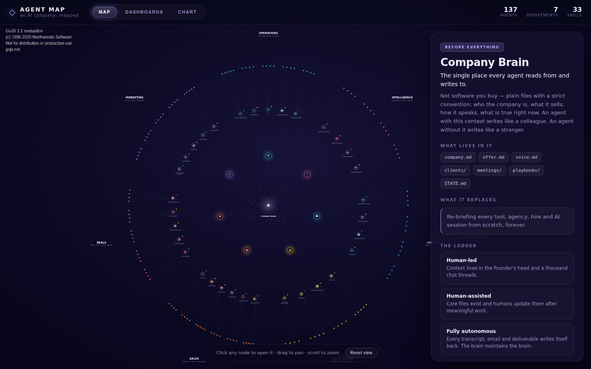

# Agent Map — an AI company, mapped

A live, interactive map of an AI-run company: **7 departments, 33 runnable skills and 137 agents**
radiating from a shared **Company Brain** (the knowledge base every agent reads from and writes to).

Inspired by the "137 AI agents run an entire company" concept, this is not just a diagram — every
node opens. Click a department to focus its tree, click a skill to see what it replaces / where it
sits on the autonomy ladder / which agents make it up, and click an individual agent for its detail.

Built with **[GoJS](https://gojs.net)** for the radial constellation and **Angular** for the shell,
detail panels, dashboards and chart.



## What's in it

- **MAP** — the constellation. A glowing Company Brain at the centre, 7 department hubs around it,
  each branching into skills and then into the individual agents that do the work. Click to focus &
  zoom a department; click any node to open its detail panel; drag to pan, scroll to zoom.
- **DASHBOARDS** — the whole company counted: agents / skills / departments, deployment status
  (live · in development · planned), the autonomy ladder (human-led · assisted · autonomous), and a
  card per department.
- **CHART** — agents per department, each bar broken down by deployment status.

Every department, skill and agent lives in a single source of truth: [`src/app/company-data.ts`](src/app/company-data.ts).
Add a department, skill or agent there and it flows through the map, the dashboards and the chart
automatically — the radial layout is computed from the data.

## Architecture

| File | Responsibility |
| --- | --- |
| `src/app/company-data.ts` | The company model (departments → skills → agents), the radial graph builder and the stats used by the dashboards/chart. |
| `src/app/app.component.ts` | GoJS diagram (node/link templates, selection, department focus + zoom) and the view/tab state. |
| `src/app/app.component.html` / `.css` | The product shell: header, tabs, detail panel, dashboards and chart. |

## Installation

```
npm install
```

## Running the project

Because this uses the Angular 9 toolchain, run under Node 17+ with the legacy OpenSSL provider:

```
NODE_OPTIONS=--openssl-legacy-provider npm start
```

Then open [http://localhost:4200](http://localhost:4200).

To build:

```
NODE_OPTIONS=--openssl-legacy-provider npm run build
```

## Notes

- The GoJS evaluation watermark shown in the corner is part of the unlicensed GoJS library used by
  this sample; it is not part of the app UI.

Originally scaffolded from Northwoods Software's `gojs-angular-basic` sample.
